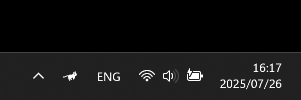

# CPU Pets 🐾

**CPU Pets** is a fun and lightweight Windows tray application that shows animated pets (Cat, Parrot, Horse) in your system tray.  
The animation speed changes dynamically based on your **CPU usage**, making it both entertaining and a subtle system monitor.  

---

## 🐾 Demo



## ✨ Features
- 🖼️ **Animated Tray Icons** – Pets move smoothly in the tray area.  
- ⚡ **CPU-Based Animation** – The higher your CPU usage, the faster the pet moves.  
- 🎨 **Light & Dark Themes** – Supports system theme detection or manual theme selection.  
- 🐱 **Multiple Pets** – Choose between Cat, Parrot, and Horse.  
- 💾 **Persistent Settings** – Saves preferences (animal, theme, startup) in `settings.json`.  
- 🔄 **Run on Startup** – Optional auto-start with Windows.  
- 🎛️ **Tray Menu** – Right-click to access options:  
  - Pause/Resume animation  
  - Switch animal  
  - Change theme (Light/Dark/Follow system)  
  - Toggle run on startup  
  - Quit the app  

---

## ⚙️ How It Works
- The app loads `.ico` frames for each pet and theme.  
- Animation speed is calculated from real-time CPU usage (via `psutil`).  
- A background thread updates the tray icon frame-by-frame.  
- User preferences are stored in a `settings.json` file.  
- System theme is checked periodically and applied if "Follow system" is enabled.  

---

## 📂 Project Structure
```
CPU_Pets/
│── cat/
│   ├── light/
│   └── dark/
│── parrot/
│   ├── light/
│   └── dark/
│── horse/
│   ├── light/
│   └── dark/
│── settings.json
│── main.py
```
Each folder contains `.ico` files for animation frames.  

---

## 🚀 Usage
1. Run the application (`PetMonitor.py` or packaged `.exe`).
2. For Download .exe file click [CpuPets](https://github.com/Kiyarakks/Cpu-Pets/releases/download/v1.0.0/CpuPets.v1.0.0.exe)
3. A pet icon will appear in your **system tray**.  
4. Right-click the icon to open the menu and configure settings.  

---

## 🛠️ Requirements (not for .exe file)
- Python 3.8+  
- Dependencies:  
  ```bash
  pip install psutil pillow pystray
  ```

---

## 📌 Notes
- Works on **Windows only** (uses `winreg` for startup registry).  
- If `.ico` frames are missing, the app will raise an error.
- Only `.ico` files are supported (due to Windows tray requirements).  
- Icon size is recommended to be **16/20/24/32 px** for best results if you want some changes.  

---
