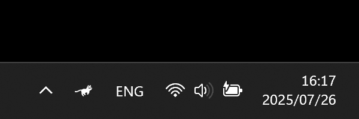

# CPU Pets 🐾
 
**CPU Pets** is a fun and lightweight Windows tray application that shows animated pets (Cat, Parrot, Horse) in your system tray.  
The animation speed changes dynamically based on your **CPU usage**, making it both entertaining and a subtle system monitor.  
 
---

## 🐾 Demo



## ✨ Features
- 🖼️ **Animated Tray Icons** – Pets move smoothly in the tray area.  
- ⚡ **CPU-Based Animation** – The higher your CPU usage, the faster the pet moves.  
- 🎨 **Automatic Light & Dark Theme** – Detects the current Windows theme and recolors the pet icon (white on dark theme, black on light theme) automatically — no manual switch needed.  
- 🚨 **CPU 100% Alert** – Shows a one-time tray notification when CPU usage hits 100%, and won't notify again until usage drops back below 90% and spikes again.  
- 🐱 **Multiple Pets** – Choose between Cat, Parrot, and Horse.  
- 💾 **Persistent Settings** – Saves your chosen animal and startup preference in `settings.json`.  
- 🔄 **Run on Startup** – Optional auto-start with Windows.  
- 🎛️ **Tray Menu** – Right-click to access options:  
  - Pause/Resume animation  
  - Switch animal  
  - Toggle run on startup  
  - Quit the app  

---

## ⚙️ How It Works
- The app loads `.ico` frames for each pet and theme. If frames are missing for a given animal/theme, a simple default placeholder icon is used instead (the app no longer fails to start).  
- Animation speed is calculated from real-time CPU usage (via `psutil`).  
- A background thread updates the tray icon frame-by-frame and recolors it to match the current Windows theme.  
- Each cycle, the instantaneous CPU value is checked against the alert threshold (100%) and a tray notification is triggered once per usage spike.  
- If a notification ever fails to send, the error is logged to `alert_error.log` next to `settings.json` (since the console window is hidden).  
- User preferences (selected animal, run-on-startup) are stored in a `settings.json` file.  
- The system theme is checked continuously and applied automatically — there is no manual theme override.
---

## 📂 Project Structure
```
CPU_Pets/
│── cat/
│   ├── light/
│   └── dark/
│── parrot/
│   ├── light/
│   └── dark/
│── horse/
│   ├── light/
│   └── dark/
│── settings.json
│── alert_error.log      (created only if a notification fails)
│── main.py
```

Each folder contains `.ico` files for animation frames. Icons can be plain silhouettes — the app tints them white or black automatically depending on the active Windows theme.

---

## 🚀 Usage
1. Run the application (`PetMonitor_new.py` or packaged `.exe`).
2. For Download .exe file click [CpuPets](https://github.com/Kiyarakks/Cpu-Pets/releases/download/v1.1.0/CpuPets.v1.1.0.exe)
3. A pet icon will appear in your **system tray**.  
4. Right-click the icon to open the menu and configure settings.  

---

## 🛠️ Requirements (not for .exe file)
- Python 3.8+  
- Dependencies:  
```bash
  pip install psutil pillow pystray
```

---

## 📌 Notes
- Works on **Windows only** (uses `winreg` for startup registry and theme detection).  
- If `.ico` frames are missing for an animal/theme, the app falls back to a default placeholder icon instead of crashing.  
- Tray notifications depend on OS/backend support for `pystray`'s `notify()` — if it silently fails, check `alert_error.log`.  

---
