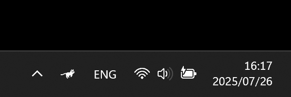

# CPU Pets 🐾

**CPU Pets** is a fun and lightweight Windows tray application that shows animated pets (Cat, Parrot, Horse) in your system tray.
The animation speed changes dynamically based on your **CPU usage**, making it both entertaining and a subtle system monitor.
It also includes a built-in **Screen Time** tracker that keeps a full history of app usage, right from the same tray icon.

---

## 🐾 Demo



## ✨ Features

### 🐱 The Pet (tray icon)
- 🖼️ **Animated Tray Icons** – Pets move smoothly in the tray area.
- ⚡ **CPU-Based Animation** – The higher your CPU usage, the faster the pet moves.
- 🎨 **Automatic Light & Dark Theme** – Detects the current Windows theme and recolors the pet icon (white on dark theme, black on light theme) automatically — no manual switch needed.
- 🚨 **CPU 100% Alert** – Shows a one-time tray notification when CPU usage hits 100%, and won't notify again until usage drops back below 90% and spikes again.
- 🐾 **Multiple Pets** – Choose between Cat, Parrot, and Horse.
- 🖥️ **Live Tooltip** – Hover over the icon to see current CPU usage, RAM usage, and system uptime at a glance.
- 🎛️ **Custom Dark Tray Menu** – Right-click opens a modern, dark-themed menu (not the native Windows menu) with:
  - Pause/Resume animation
  - Switch animal
  - Toggle the CPU 100% alert
  - Open Screen Time
  - Toggle run on startup
  - Quit the app
- 🔄 **Run on Startup** – Optional auto-start with Windows.
- 💾 **Persistent Settings** – Saves your chosen animal, alert preference, and startup preference in `settings.json`.

### ⏱️ Screen Time (opened from the tray)
- 📊 Tracks how long each application is the active (foreground) window.
- 😴 Automatically skips counting time while the system is idle (no keyboard/mouse input).
- 🗂️ **Long-term history** – Usage is stored in a local SQLite database (`screen_time.db`), one entry per day per app, so your history builds up indefinitely (months, even years) instead of being overwritten every day.
- 📅 **Date picker** – Browse today's usage or jump back to any previous day that has recorded data.
- 🖱️ Opens from the pet's tray menu ("Screen Time") or with a single left click on the tray icon; closing the window just hides it, tracking keeps running in the background.

---

## ⚙️ How It Works
- The whole app runs on **PyQt5** (a single `QApplication` event loop) — the pet's tray icon, its dark context menu, and the Screen Time window are all part of the same process, so no extra background threads are needed to bridge them.
- The app loads `.ico` frames for each pet and theme. If frames are missing for a given animal/theme, a simple default placeholder icon is used instead (the app no longer fails to start).
- Animation speed is calculated from real-time CPU usage (via `psutil`) and driven by a `QTimer` that reschedules itself with a variable delay each frame.
- The tray icon is repainted frame-by-frame and recolored to match the current Windows theme, which is polled periodically.
- Each cycle, the instantaneous CPU value is checked against the alert threshold (100%) and a tray notification is triggered once per usage spike.
- If a notification ever fails to send, the error is logged to `alert_error.log` next to `settings.json` (since the console window is hidden).
- The tray tooltip refreshes every couple of seconds with current CPU%, RAM%, and system uptime.
- A dedicated background thread (`QThread`) polls the active foreground window for Screen Time, writing accumulated seconds straight into the SQLite database so nothing is lost between restarts or across days.
- User preferences (selected animal, CPU alert toggle, run-on-startup) are stored in a `settings.json` file.
- The system theme is checked continuously and applied automatically — there is no manual theme override.

---

## 📂 Project Structure
```
CPU_Pets/
│── cat/
│   ├── light/
│   └── dark/
│── parrot/
│   ├── light/
│   └── dark/
│── horse/
│   ├── light/
│   └── dark/
│── main.pyw
```

Each folder contains `.ico` files for animation frames. Icons can be plain silhouettes — the app tints them white or black automatically depending on the active Windows theme.

At runtime, the app creates a data folder under `%APPDATA%\CPU_Pets\` containing:
```
%APPDATA%\CPU_Pets\
│── settings.json        (pet preferences: animal, CPU alert, run on startup)
│── screen_time.db        (SQLite database with full Screen Time history)
│── alert_error.log       (created only if a notification fails)
```

---

## 🚀 Usage
1. Run the application (`main.pyw`, or a packaged `.exe`).
2. For Download .exe file click [CpuPets](https://github.com/Kiyarakks/Cpu-Pets/releases/download/v2.0.0/CpuPets.v2.0.0.exe)
3. A pet icon will appear in your **system tray**.
4. Right-click the icon to open the menu and configure settings, or left-click to quickly open Screen Time.

---

## 🛠️ Requirements (not for .exe file)
- Python 3.8+
- Dependencies:
```bash
  pip install psutil pillow PyQt5 pywin32
```

---

## 📌 Notes
- Works on **Windows only** (uses `winreg` for startup registry and theme detection, and `pywin32` for foreground-window/idle detection).
- If `.ico` frames are missing for an animal/theme, the app falls back to a default placeholder icon instead of crashing.
- Tray notifications use Qt's native `QSystemTrayIcon.showMessage()` — if one ever silently fails, check `alert_error.log`.
- Screen Time history is kept forever by default; delete `screen_time.db` under `%APPDATA%\CPU_Pets\` if you ever want to reset it.

---
